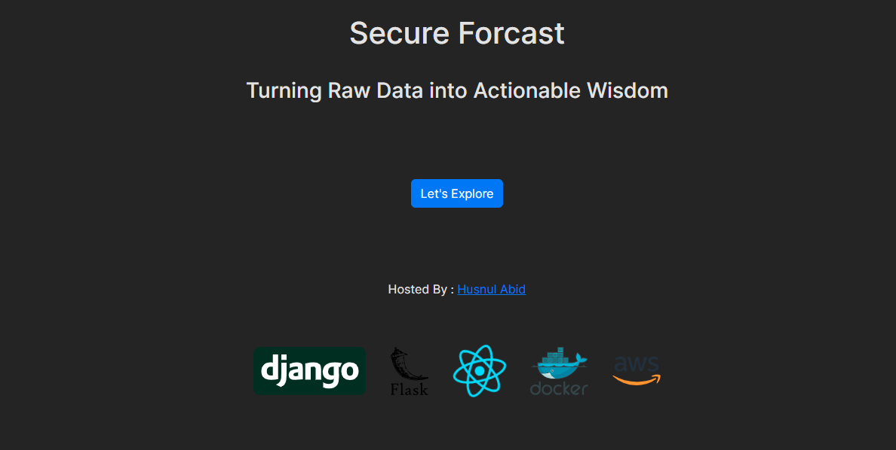
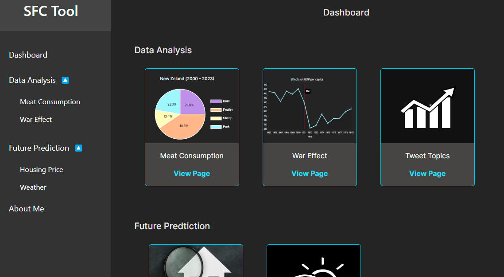
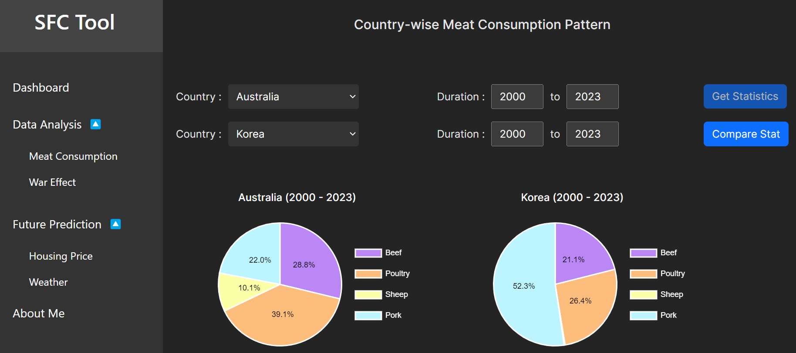
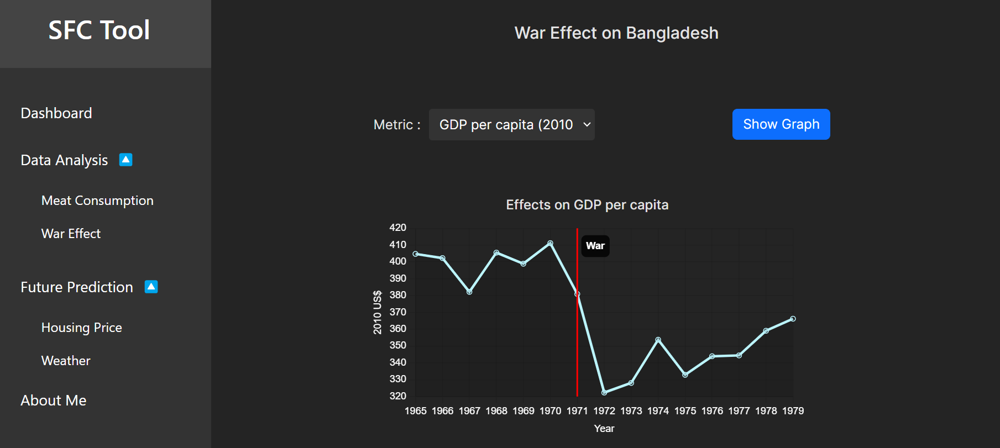

# SFC_Client

This template provides a minimal setup to get React working in Vite with HMR and some ESLint rules.
Using SFC Client which is build with React, we can visualize data analytics API. 

## Features 
    * Dashboard
    * Meat consumption data analysis
    * War effect data analysis

## Setup SFC_Client Locally

1. Please clone the repository

2. Install node dependencies using npm install 

3. Run the program uisng npm run dev

## Few pages of SFC Client

Landing Page:

Dashboard: 

Meat Consumption Analysis:

War Effect Analysis:

